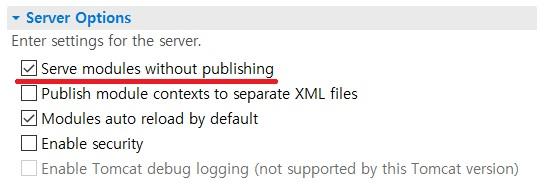

# ibatis 로 게시판 만들기

## 중요사항
- sql-config.xml
  ```xml
  <?xml version="1.0" encoding="UTF-8"?>
  <!DOCTYPE sqlMap
          PUBLIC "-//ibatis.apache.org//DTD SQL Map 2.0//EN"
          "http://ibatis.apache.org/dtd/sql-map-2.dtd">
  
  <sqlMapConfig>
    <properties resource="system.properties"/>
      <settings
          cacheModelsEnabled="true"
          enhancementEnabled="true"
          lazyLoadingEnabled="true"
          maxRequests="20"
          maxSessions="10"
          maxTransactions="10"
          useStatementNamespaces="false"
      />
      <transactionManager type="JDBC">
          <dataSource type="DBCP">
              <property name="JDBC.Driver" value="${DB_CLASS}"/>
              <property name="JDBC.ConnectionURL" value="${DB_URL}"/>
              <property name="JDBC.Username" value="${DB_USER}"/>
              <property name="JDBC.Password" value="${DB_USERPWD}"/>
              <property name="Pool.MaximumActiveConnections" value="10"/>
              <property name="Pool.MaximumIdleConnections" value="10"/>
              <property name="Pool.MaximumWait" value="60000"/>
              <property name="Pool.ValidationQuery" value="select 1 from dual"/>
              <property name="Pool.LogAbandoned" value="false"/>
              <property name="Pool.RemoveAbandoned" value="false"/>
              <property name="Pool.RemoveAbandonedTimeout" value="60000"/>
          </dataSource>
      </transactionManager> 
      <sqlMap resource="biz/domain/board/Board.xml"/>
  </sqlMapConfig>
  ```

<br>

- sqlMap.xml
  ```xml
  <?xml version="1.0" encoding="UTF-8" ?>
  <!DOCTYPE sqlMap
          PUBLIC "-//ibatis.apache.org//DTD SQL Map 2.0//EN"
          "http://ibatis.apache.org/dtd/sql-map-2.dtd">
  <sqlMap namespace="">
    <!-- 내부 속성값 지정 -->
  </sqlMap>
  ```
  
<hr>
<br>
  
## 파일업로드(MultipartRequest-cos.jar) 사용시
- 로컬 파일업로드 테스트는 톰캣 서버 설정이 필요

  